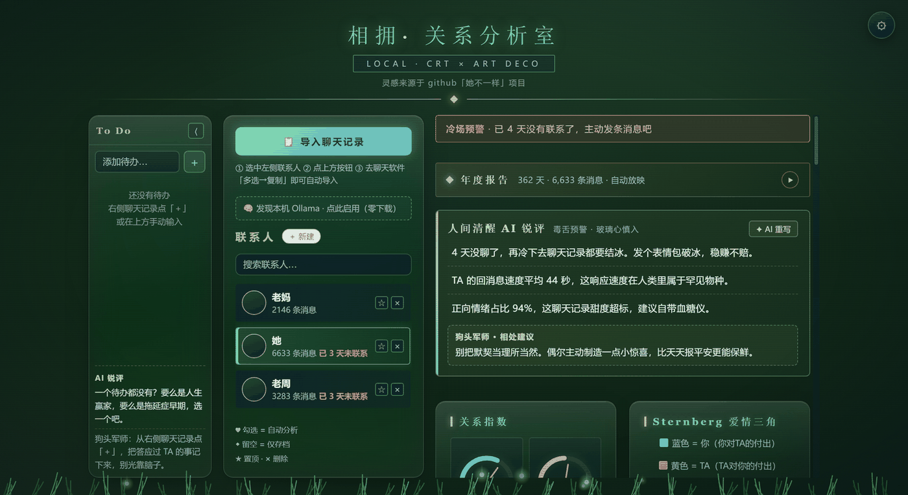
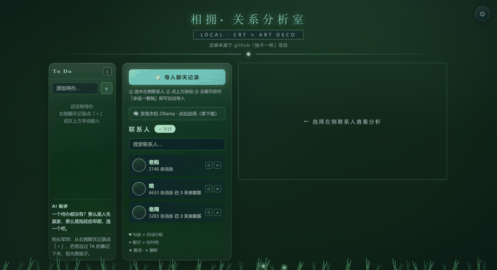
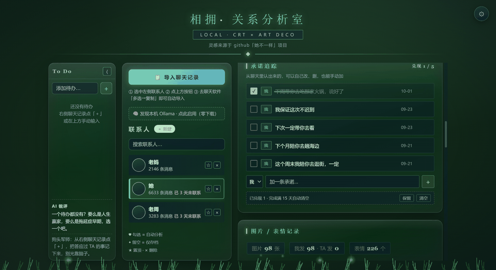
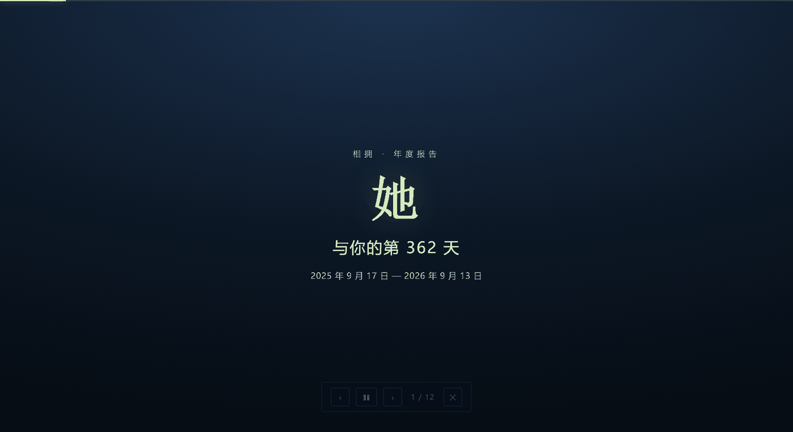
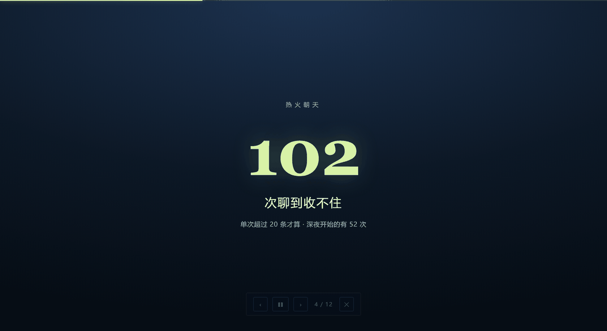

# 相拥 · 关系分析室

> 灵感来源于 GitHub「她不一样」项目

**把你们的聊天记录，变成看得见的东西。**



一个**完全本地运行**的中文聊天关系分析桌面应用。谁说得更多、聊了多久、热词是什么、冷场了多少天……最后再给你几句不客气的「AI 锐评」，以及一份能翻着看的年度报告。

AI 是**内置**的 —— 三档本地小模型随应用一起装，**开箱即用，不需要另外部署 Ollama 或任何外部服务**。

> **本工具不解密、不逆向、不碰数据库。** 它只做一件最简单、最干净的事：利用「复制与粘贴」。

---

## 界面一览

| 联系人列表 | 承诺追踪 |
|---|---|
|  |  |

| 年度报告 · 封面 | 年度报告 · 内页 |
|---|---|
|  |  |

**三个可解释的关系指数** —— 主动 / 被爱 / 冷淡，每个指数点开都能看到「这 71 分是怎么算出来的」：

| 被爱与主动 | 冷淡 |
|---|---|
|  |  |

---

## 原理：只用「复制粘贴」

| 数据 | 来源 | 说明 |
|---|---|---|
| **文字** | 剪贴板 | 你在聊天窗口「多选 → 复制」，工具监听剪贴板变化，自动解析「昵称 / 时间 / 内容」格式，逐条入库 |
| **图片** | 明文缩略图缓存 | 聊天软件自己会在本地留下**已经解码好**的缩略图（`.jpg`），工具只读这些现成文件，**不做任何解密**；只有「你点开看过」的图片才会被缓存 |
| **语音** | ❌ 不支持 | 不解密就拿不到语音内容，所以不做 |

所有数据**只在本机处理，绝不上传**。

---

## 功能一览

**📊 分析**

- 消息数、时间跨度、谁话多、秒回情况、冷场天数、趋势图
- 💯 **可解释的关系指数**：主动 / 被爱 / 冷淡三个指数由多个信号合成，点开就能看到每个信号贡献了多少分
- 📖 **年度报告**：页数按聊天量动态生成（最多 15 页），页与页之间有动画与元素联动，页码鼠标移入才显示
- 🔤 **热词榜**：中文分词 + 随包词表选词，不再出现「天早起跑」这类跨词碎片

**🤖 AI**

- 🧠 **内置本地 AI**：轻 / 标准 / 专业三档（3B / 7B / 14B），按显存自动推荐，装完即用
- 🗣 **AI 锐评**：毒舌但友好，按你们真实的聊天数据生成
- 💤 **显存闲置归还**：分析结束闲置 120 秒，自动把模型从显存搬回内存；下次要用再搬回来 —— 打游戏时不至于和游戏抢显存
- ✅ **不编数字**：AI 说出口的每个数字都会与真实统计核对，编造的数字会被拦下

**✍️ 编辑**

- 每条消息都能改，改过会标「已编辑」
- ✅ **To-Do 待办**：从聊天记录一键把「答应过 TA 的事」记下来，可自行增删改，并跟踪兑现情况
- 🖼 **自定义头像**：右键联系人即可换头像，支持选图或直接粘贴

**🎨 体验**

- 🎨 **自由主题**：预设配色 + 任意取色，还有个「绿色长草」小彩蛋
- 🔊 **界面音效**：所有音效与背景音乐都是 Web Audio 现场合成，**零音频文件**（因此也零版权问题），可在设置里单独调节响度
- 📱 **局域网访问**：同一 Wi-Fi 下手机浏览器也能看
- 🔒 **防多开**：重复启动会唤起已有窗口，不会开出第二个应用、也不会抢端口

---

## 快速开始

需要：**Node.js 22+**（用到了内置 `node:sqlite`，仅存储本地消息缓存）。

```bash
# 1. 安装依赖
npm install

# 2. 启动桌面应用
npm start

# 或者只跑服务 + 浏览器
npm run server
# 然后打开 http://localhost:4322
```

使用流程：

1. 左侧「＋ 新建」，输入对方昵称；
2. 选中该联系人，点「📋 导入聊天记录」；
3. 去电脑聊天软件打开与 TA 的对话，右键「多选」→ 勾选一批 →「复制」；
4. 反复几次，点「⏹ 停止并导入」，首次会问「哪个是你自己」；
5. 看分析结果。

> 提示：电脑端记录不全时，先用手机聊天软件「聊天记录迁移」到电脑，再回来导入。

---

## 数据与隐私

- 所有数据存在项目下的 `data/` 目录，**纯本地 JSON + SQLite**，没有任何云端同步
- 首次使用 AI 时会从 **ModelScope（魔搭，国内源）** 下载模型到 `data/models/`，下载后即可离线使用
- 想要完全干净地卸载：删掉应用目录与 `data/` 即可，不残留任何系统级痕迹

> ⚠️ **`data/` 目录永远不要提交到 git** —— 里面是真实聊天记录。仓库的 `.gitignore` 已排除，
> 打包脚本也带硬断言：一旦发现 `data/` 被卷进分发包就直接中止。

---

## 技术栈

| 层 | 选型 |
|---|---|
| 后端 | Node.js 原生 `http`（零框架依赖） |
| 前端 | 原生 HTML / CSS / JavaScript（无构建步骤） |
| 桌面壳 | Electron |
| 本地推理 | `node-llama-cpp`（Vulkan 加速，无可用 GPU 时回退 CPU） |
| 数据 | 本地 JSON + SQLite（`data/` 目录） |

### 项目结构

```
相拥-抓取版/
├── electron-main.js    桌面壳入口：单实例锁、窗口、局域网地址
├── server.js           HTTP 服务：路由、剪贴板导入、统计、报告数据
├── ai.js               本地模型：下载（ModelScope / 断点续传）、加载、显存归还
├── score.js            关系指数引擎（纯函数，无依赖，可单独测）
├── public/             前端：app.js / style.css / sound.js（Web Audio 合成）
├── wordlist.txt        中文分词词表（40,001 行）
├── emoji_name_map.json 表情名映射
├── data/               ⚠️ 你的聊天数据（永不入库）
├── 工具/               开发工具：打包、验证打包、版本对比、生成词表
├── 测试脚本/           取证式验证脚本（见 测试脚本/README.md）
├── docs/               README 配图
└── build.iss           Inno Setup 打包脚本
```

---

## 开发

### 测试

仓库里有一批针对具体问题的验证脚本，**不是单元测试框架，而是「现场取证工具」**——
每个脚本都对应过至少一个真实缺陷。

```bash
node 测试脚本/跑界面验收.js     # 界面视觉验收（51 项）
node 测试脚本/跑音效测试.js     # 音效 / BGM（43 项）
node 测试脚本/跑报告测试.js     # 年度报告三套巡检
node 测试脚本/测评分.js         # 关系评分引擎（79 项，纯 Node）
```

完整清单、运行方式与排查工具见 **[`测试脚本/README.md`](测试脚本/README.md)**。

### 打包分发

```bash
node 工具/打包.js              # 生成干净的分发目录
node 工具/打包.js --slim       # 顺带剔除上游依赖的构建期源码树（体积 -38%）
node 工具/验证打包.js          # 对分发目录做真验收：起隔离实例 + 从该目录加载 native 引擎
```

再配合 [`build.iss`](build.iss) 用 Inno Setup 编译成安装包（装到用户目录、免管理员）。

```bash
node 工具/版本对比.js <上一个版本的SHA>   # 生成发版对比数据
```

---

## 常见问题

**一定要装 Ollama 吗？**

不用，本项目也从不依赖它。AI 是内置的，模型首次使用时自动下载，全程只有内置这一条后端。

**为什么语音不支持？**

因为不解密就拿不到语音内容，而本项目不做任何解密。宁可少一个功能，也不碰红线。

**导入的记录不全？**

先用手机聊天软件的「聊天记录迁移」把记录同步到电脑，再回来复制导入。

**AI 会不会把我的聊天内容传出去？**

不会。模型在本机推理，没有云端调用。

**支持哪些平台？**

目前只在 Windows 上开发与验证。理论上 macOS / Linux 也能跑（Node + Electron 都是跨平台的），但没有实测过。

---

## 更新日志

见 **[CHANGELOG.md](CHANGELOG.md)**。

最近一版 **v0.4.0** 的主要变化：

- ✨ 新增年度报告、界面音效、可解释关系指数、三档本地模型、显存闲置归还、中文分词热词榜
- ⚡ 模型源全部换成国内 ModelScope；AI 建议与寄语改为真 AI 生成；帧间隔从 57ms 改善到 6ms
- 📦 新增一键打包与 Inno Setup 安装包（412.7 MB，装到用户目录免管理员）

---

## 免责声明

1. 本项目仅供学习、技术研究使用，仅限个人 / 家庭内部自用，禁止任何商业或违法违规用途。
2. 请只在你自己的电脑、你自己的聊天数据上使用，不要用于查看、分析、导出或传播他人的聊天记录与个人信息。
3. 本项目不存储、不上传任何数据；因使用者个人行为产生的法律后果，由使用者自行承担。
4. 二次转载、传播本项目或其衍生版本者，自行承担由此产生的一切法律责任。

---

## 致敬

> 向制作 weflow 等项目的前辈致敬，我的项目只是一个能摆在明面上的小垃圾，远不如他们的项目强大与好用。希望大家能在这个项目里，记住那些你说过要与对方一起去看的电影，记住她的生日，真实的生活在屏幕之外，祝大家，生活愉快。

---

**License:** MIT
